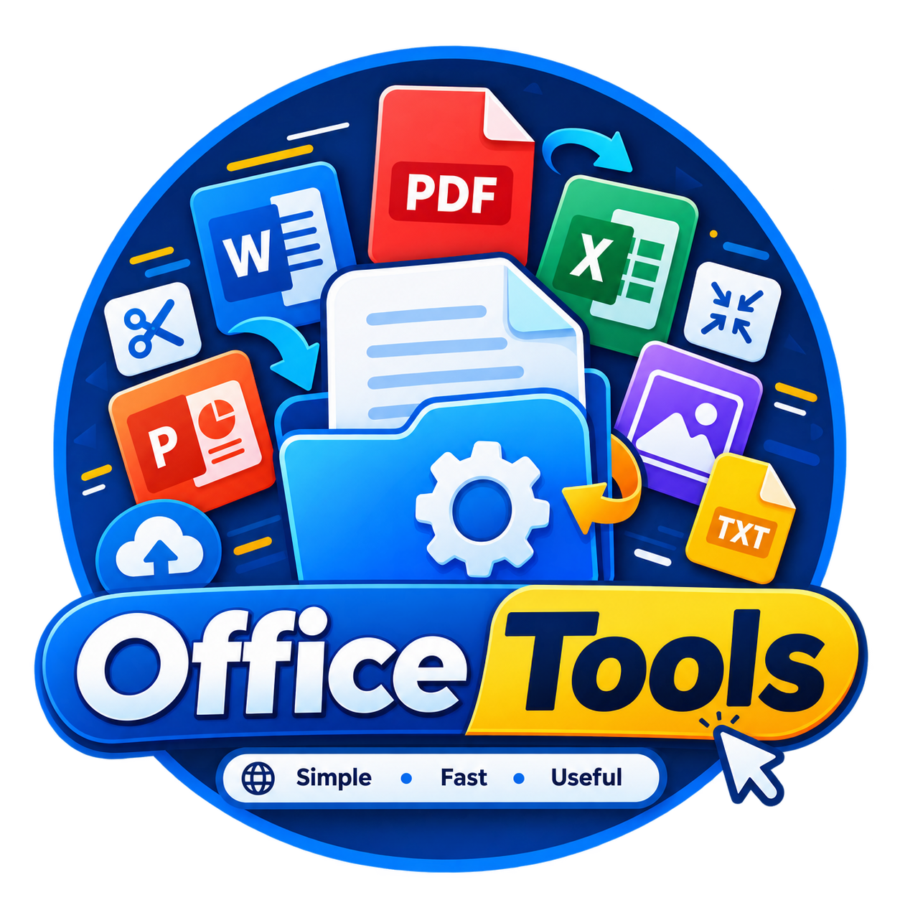

<p align="center">
  
</p>

<h1 align="center">📁 Office Tools</h1>

<p align="center">
  <strong>Simple • Fast • Useful</strong>
</p>

<p align="center">
  <strong>Office Tools</strong> adalah platform <strong>all-in-one productivity tools</strong>
  yang dirancang untuk membantu pekerjaan perkantoran, mahasiswa, siswa, guru,
  freelancer, dan pengguna umum.
</p>

<p align="center">
  Terinspirasi dari platform seperti <strong>iLovePDF</strong>, Office Tools menyediakan
  berbagai tools untuk mengelola <strong>PDF, dokumen, gambar, spreadsheet, presentasi,
  dan file lainnya</strong> dalam satu tempat.
</p>

<p align="center">
  Tujuan utama project ini adalah membuat berbagai pekerjaan yang biasanya membutuhkan
  banyak aplikasi menjadi <strong>lebih sederhana, cepat, dan mudah digunakan</strong>.
</p>

---

## ✨ Features

### 📄 PDF Tools

* Merge PDF
* Split PDF
* Compress PDF
* PDF to Word
* PDF to Excel
* PDF to PowerPoint
* Word to PDF
* Excel to PDF
* PowerPoint to PDF
* JPG to PDF
* PDF to JPG
* Rotate PDF
* Delete PDF Pages
* Extract PDF Pages
* Reorder PDF Pages
* Protect PDF
* Unlock PDF
* Add Watermark
* Add Page Numbers

### 📝 Document Tools

* Word document converter
* Text extraction
* Document compressor
* Document merger
* Document splitter
* TXT converter
* DOC/DOCX utilities
* RTF utilities

### 🖼️ Image Tools

* Image Compressor
* Image Resizer
* Image Converter
* JPG to PNG
* PNG to JPG
* WebP Converter
* Image Cropper
* Image Rotator
* Image Metadata Viewer
* Image to PDF
* Background utilities

### 📊 Office Tools

* Excel utilities
* CSV utilities
* Spreadsheet converter
* PowerPoint utilities
* Presentation converter
* Document format converter

### 🛠️ Productivity Tools

* QR Code Generator
* Barcode Generator
* Password Generator
* Text Formatter
* Word Counter
* Character Counter
* Case Converter
* URL Encoder/Decoder
* Base64 Encoder/Decoder
* JSON Formatter
* JSON Validator
* Timestamp Converter
* Unit Converter
* Color Converter

---

## 🎯 Who Is Office Tools For?

Office Tools dibuat untuk berbagai kebutuhan:

| Pengguna         | Contoh Penggunaan                            |
| ---------------- | -------------------------------------------- |
| 🧑‍💼 Karyawan   | Mengelola dokumen kantor dan PDF             |
| 🎓 Mahasiswa     | Menggabungkan tugas, mengubah format dokumen |
| 🧑‍🎓 Siswa      | Mengolah tugas dan file pembelajaran         |
| 👨‍🏫 Guru       | Mengelola materi dan dokumen                 |
| 💻 Programmer    | JSON, Base64, URL dan developer utilities    |
| 🎨 Designer      | Resize, compress, dan convert gambar         |
| 🧑‍💻 Freelancer | Mengelola dokumen dan file client            |
| 🏢 Perusahaan    | Workflow dokumen dan file management         |

---

## 🚀 Why Office Tools?

Banyak pekerjaan sederhana membutuhkan banyak aplikasi berbeda.

Contohnya:

```text
Merge PDF       → aplikasi A
Compress PDF    → aplikasi B
Resize Image    → aplikasi C
Convert DOCX    → aplikasi D
JSON Formatter  → aplikasi E
```

Office Tools mencoba menyatukan semuanya:

```text
                 ┌─────────────────────┐
                 │    OFFICE TOOLS     │
                 ├─────────────────────┤
                 │ PDF Tools           │
                 │ Document Tools      │
                 │ Image Tools         │
                 │ Office Tools        │
                 │ Developer Tools     │
                 │ Productivity Tools  │
                 └─────────────────────┘
                          │
                          ▼
                    One Platform
```

---

## 🎨 Design Philosophy

Office Tools menggunakan prinsip:

* **Simple** — mudah digunakan oleh siapa saja
* **Fast** — proses file secepat mungkin
* **Useful** — setiap tool memiliki fungsi praktis
* **Responsive** — nyaman digunakan di desktop, tablet, maupun mobile
* **Modern** — UI bersih dan modern
* **Privacy-focused** — file pengguna harus diproses dengan aman

---

## 🔐 Privacy

Privacy menjadi salah satu bagian penting dari Office Tools.

Prinsip yang ingin diterapkan:

* File pengguna tidak disimpan lebih lama dari yang diperlukan.
* File sementara dapat dihapus secara otomatis.
* Tidak menjual data pengguna.
* Tidak menggunakan file pengguna untuk tujuan yang tidak diizinkan.
* Proses upload dan download menggunakan koneksi yang aman.
* Tool yang memungkinkan akan melakukan pemrosesan langsung di browser.

> **Your files are yours.**

---

## 🏗️ Project Architecture

Office Tools dirancang agar setiap tool dapat dikembangkan secara modular.

```text
office-tools/
│
├── apps/
│   ├── web/
│   └── api/
│
├── packages/
│   ├── ui/
│   ├── pdf/
│   ├── documents/
│   ├── images/
│   └── utilities/
│
├── public/
│
├── docs/
│
├── tests/
│
├── .env.example
├── .gitignore
├── README.md
└── package.json
```

Struktur aktual dapat berubah mengikuti perkembangan project.

---

## 🧩 Tool Categories

Office Tools menggunakan sistem kategori agar pengguna dapat menemukan tools dengan mudah.

```text
PDF
├── Merge
├── Split
├── Compress
├── Convert
├── Protect
└── Edit

Documents
├── Word
├── TXT
├── RTF
└── Document Converter

Images
├── Compress
├── Resize
├── Convert
├── Crop
└── Image → PDF

Office
├── Excel
├── CSV
└── PowerPoint

Developer
├── JSON
├── Base64
├── URL
└── Timestamp

Utilities
├── QR Code
├── Password Generator
├── Word Counter
└── Unit Converter
```

---

## 📦 Planned Features

Roadmap pengembangan Office Tools:

* [ ] PDF Merge
* [ ] PDF Split
* [ ] PDF Compress
* [ ] PDF Converter
* [ ] PDF Editor
* [ ] Image Compressor
* [ ] Image Converter
* [ ] Image Resizer
* [ ] Word Converter
* [ ] Excel Converter
* [ ] PowerPoint Converter
* [ ] QR Code Generator
* [ ] Password Generator
* [ ] JSON Formatter
* [ ] Developer Utilities
* [ ] Drag & Drop File Upload
* [ ] Batch File Processing
* [ ] File Preview
* [ ] Processing Progress
* [ ] Dark Mode
* [ ] User Accounts
* [ ] Processing History
* [ ] API
* [ ] REST API Documentation
* [ ] API Authentication
* [ ] Admin Dashboard
* [ ] Usage Analytics
* [ ] Internationalization / i18n

---

## 🖥️ User Experience

Contoh workflow:

```text
User
 │
 ▼
Select Tool
 │
 ▼
Upload / Drag & Drop File
 │
 ▼
Process File
 │
 ▼
Preview Result
 │
 ▼
Download
```

Contoh:

```text
┌───────────────────────────────────────┐
│            Merge PDF                  │
│                                       │
│   Drag & Drop your PDF files here     │
│                                       │
│            [ Select Files ]            │
│                                       │
│   file-1.pdf              ✓            │
│   file-2.pdf              ✓            │
│                                       │
│            [ Merge PDF ]              │
└───────────────────────────────────────┘
```

---

## ⚡ Performance

Office Tools ditargetkan untuk:

* Fast file processing
* Minimal UI latency
* Efficient memory usage
* Batch processing
* Streaming untuk file berukuran besar
* Client-side processing jika memungkinkan
* Automatic cleanup untuk temporary files

---

## 🔧 Development

Clone repository:

```bash
git clone https://github.com/YOUR_USERNAME/office-tools.git
cd office-tools
```

Install dependencies:

```bash
npm install
```

Copy environment configuration:

```bash
cp .env.example .env
```

Start development server:

```bash
npm run dev
```

Build production:

```bash
npm run build
```

Run production:

```bash
npm start
```

> Sesuaikan command di atas dengan stack dan package manager yang digunakan project.

---

## 🧪 Testing

Jalankan test:

```bash
npm test
```

Lint:

```bash
npm run lint
```

Type checking:

```bash
npm run typecheck
```

---

## 🤝 Contributing

Kontribusi sangat terbuka.

Jika ingin berkontribusi:

1. Fork repository.
2. Buat branch baru.

```bash
git checkout -b feature/new-tool
```

3. Buat perubahan.
4. Jalankan test dan lint.
5. Commit perubahan.

```bash
git commit -m "feat: add new productivity tool"
```

6. Push branch.

```bash
git push origin feature/new-tool
```

7. Buat Pull Request.

### Contribution Ideas

Anda dapat berkontribusi dengan:

* Menambahkan tool baru
* Memperbaiki bug
* Meningkatkan UI/UX
* Meningkatkan performa
* Menambahkan test
* Memperbaiki dokumentasi
* Menambahkan dukungan format file baru
* Meningkatkan accessibility

---

## 🗺️ Roadmap

### Phase 1 — Core Tools

```text
PDF
 ├─ Merge
 ├─ Split
 ├─ Compress
 └─ Convert

Image
 ├─ Compress
 ├─ Resize
 └─ Convert
```

### Phase 2 — Office

```text
Word
Excel
PowerPoint
CSV
TXT
```

### Phase 3 — Productivity

```text
QR Generator
Password Generator
Text Tools
Developer Tools
Unit Converter
```

### Phase 4 — Platform

```text
User Account
History
Batch Processing
Cloud Storage
API
Admin Dashboard
```

### Phase 5 — Advanced

```text
AI Document Processing
OCR
Document Summarization
AI PDF Assistant
Smart File Conversion
Workflow Automation
```

---

## 🌟 Vision

Office Tools tidak hanya ingin menjadi PDF converter.

Visinya adalah menjadi:

> **A complete digital toolbox for work, study, and everyday productivity.**

Satu platform untuk membantu:

**Work → Study → Create → Convert → Organize**

---

## 📜 License

License project dapat ditentukan sesuai kebutuhan project.

Contoh:

```text
MIT License
```

---

## ⭐ Support

Jika project ini bermanfaat, jangan lupa memberikan ⭐ pada repository.

Feedback, issue, dan pull request sangat diterima.

---

<div align="center">

### 📁 Office Tools

**Simple • Fast • Useful**

Made for **Work, Study & Productivity**

</div>
